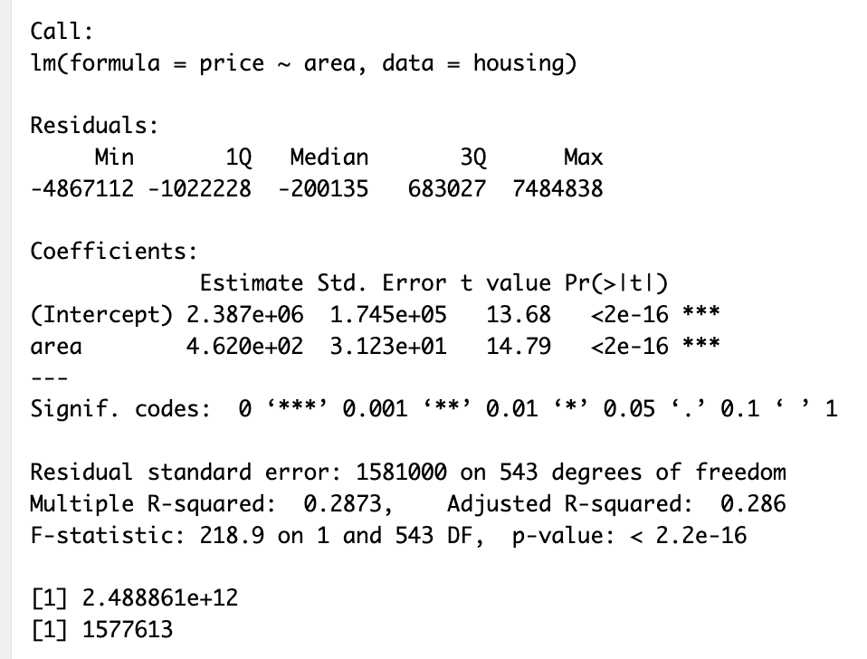
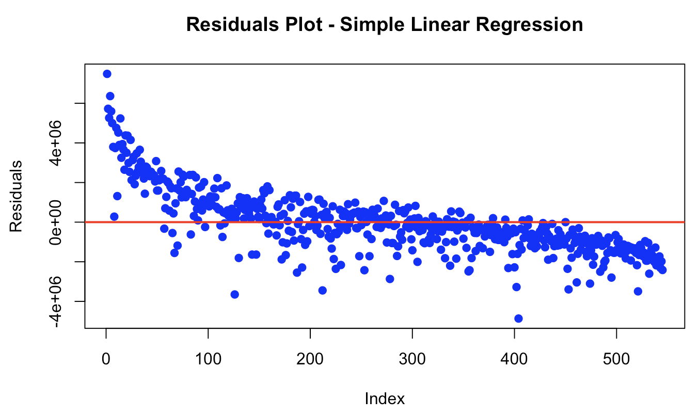
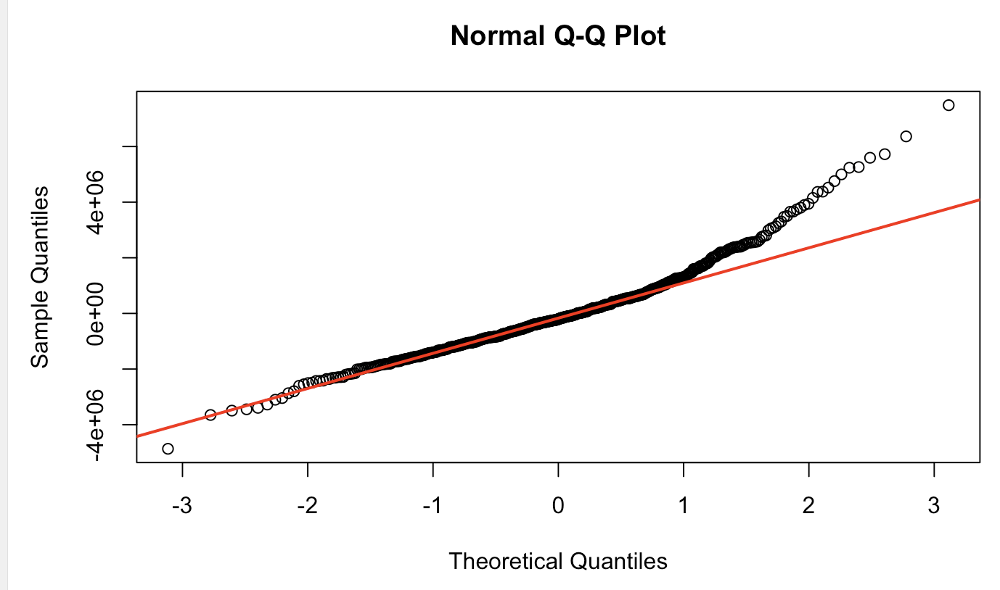
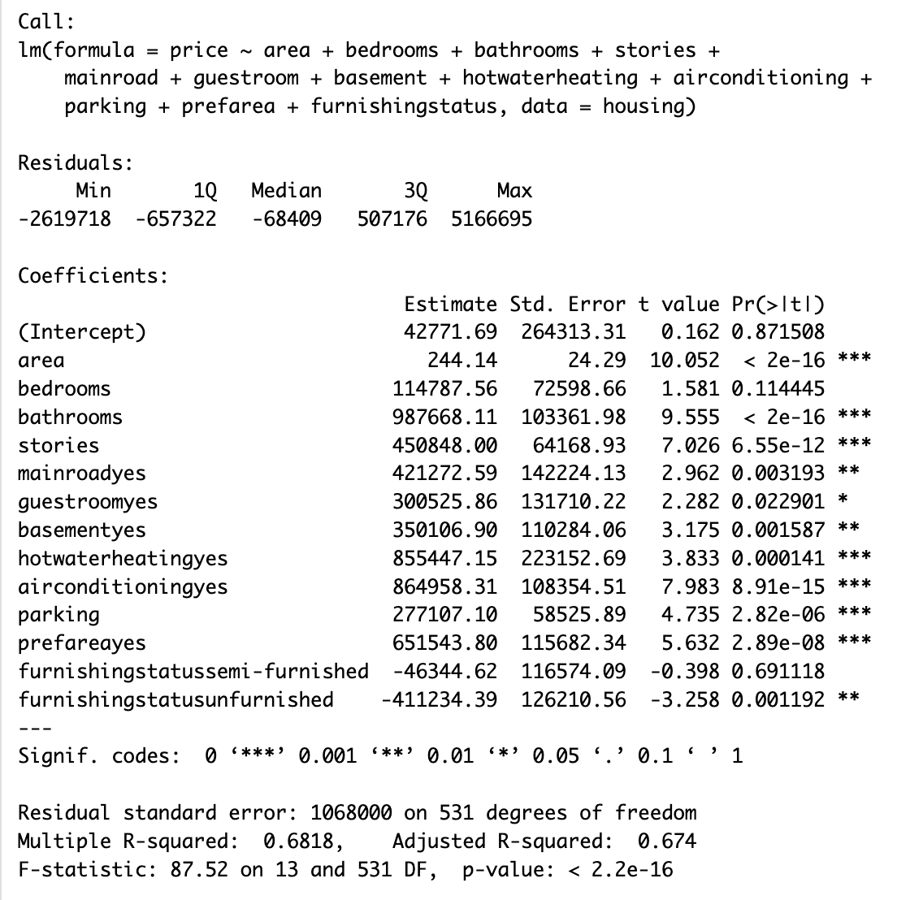
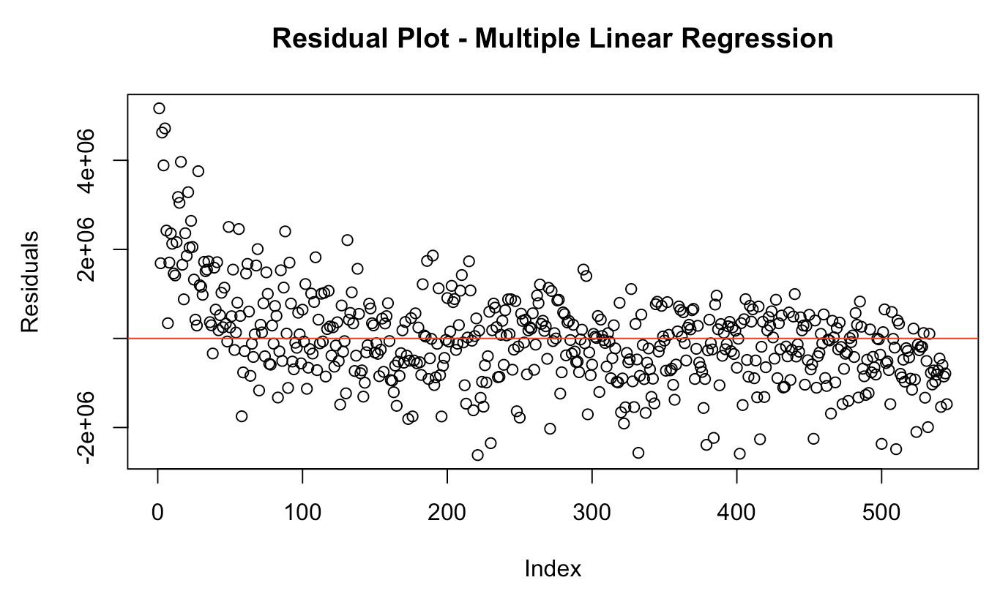
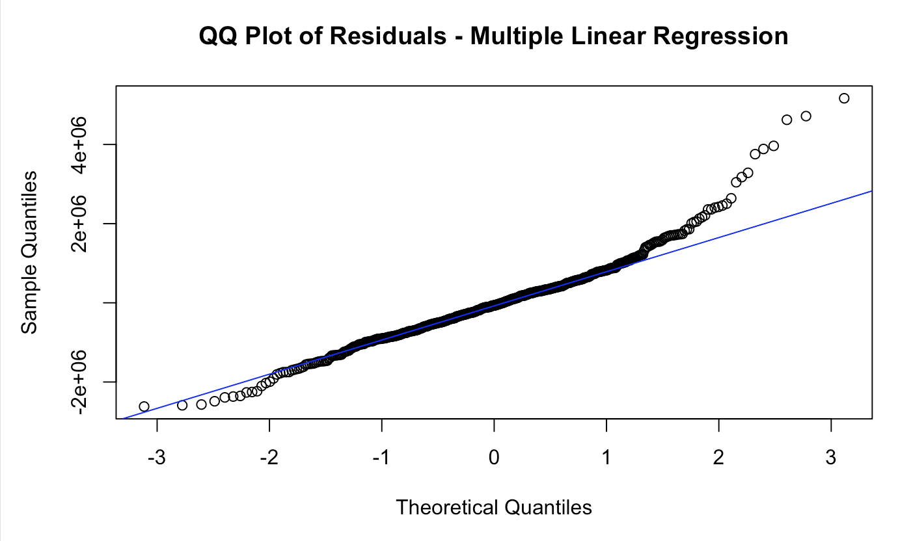
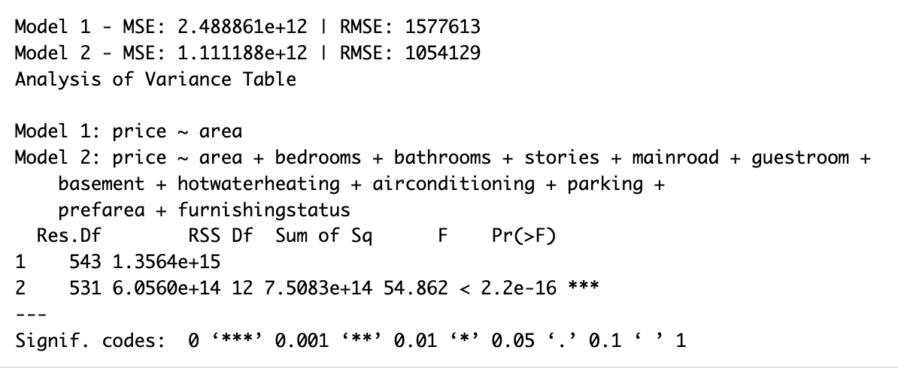

# Housing Price Regression Analysis in R


---

## Overview

This project applies **simple and multiple linear regression** in R to analyze residential housing data and predict sale prices. Starting with area as a single predictor, the analysis progressively builds a more powerful model by incorporating structural features, amenities, and location variables. Model performance is evaluated using R², MSE, RMSE, residual analysis, QQ plots, and ANOVA comparison.

---

## Tools & Libraries

| Tool | Purpose |
|------|---------|
| R / RStudio | Primary analysis environment |
| Base R `lm()` | Linear modeling |
| `readr` | Data ingestion |
| `ggplot2` | Data visualization |
| Base R plots | Residual and QQ plots |

---

## Project Structure

```
R-Housing-Price-Regression/
│
├── Housing_Price_Regression_Analysis.Rmd   # Full analysis file
├── housing.csv                              # Dataset
├── Images/                                  # Output plots and summaries
│   ├── model1_summary.png
│   ├── model1_residuals.png
│   ├── model1_qqplot.png
│   ├── model2_summary.png
│   ├── model2_residuals.png
│   ├── model2_qqplot.png
│   └── model_comparison.png
├── .gitignore
└── README.md
```

---

## Dataset
**Source:** [Housing Prices Dataset — Kaggle](https://www.kaggle.com/datasets/yasserh/housing-prices-dataset)

The dataset contains residential housing records with the following features:
- **Numerical**: Area, bedrooms, bathrooms, stories, parking
- **Categorical**: Main road access, guest room, basement, hot water heating, air conditioning, preferred area, furnishing status
- **Target Variable**: Sale price

---

##  Analysis Walkthrough

### Step 1 — Simple Linear Regression: Area → Price

Built a baseline model using area as the sole predictor of sale price.



**Key Results:**
- R² = 0.287 — area explains ~28.7% of price variation
- RMSE ≈ $1,577,613 — high prediction error with one predictor

---

### Step 2 — Residual Analysis: Simple Model

Plotted residuals to check for patterns around zero.



> Residuals show a systematic pattern rather than random scatter, suggesting the simple model does not fully capture the relationship between area and price.

---

### Step 3 — Normality Check: QQ Plot

Assessed whether residuals follow a normal distribution.



> Residuals are approximately normal through most of the distribution but deviate in the upper tail, indicating the model underpredicts prices for higher-value properties.

---

### Step 4 — Multiple Linear Regression: Adding All Predictors

Expanded the model to include structural, amenity, and location variables.



**Key Results:**
- Adjusted R² = 0.674 — explains ~67.4% of price variation
- Statistically significant predictors: area, bathrooms, stories, main road, basement, air conditioning, preferred area
- Bedrooms not significant (p = 0.11), likely due to collinearity with other size variables
- Unfurnished status negatively associated with price

---

### Step 5 — Residual Analysis: Multiple Model



> Residuals are more randomly distributed around zero compared to the simple model, indicating improved fit and more consistent predictions.

---

### Step 6 — Normality Check: QQ Plot for Multiple Model



> Residuals closely follow the normal line through most of the distribution with only minor tail deviations, satisfying the normality assumption.

---

### Step 7 — Model Comparison



---

## Results Summary

| Metric | Simple Regression | Multiple Regression | Improvement |
|--------|:-----------------:|:-------------------:|:-----------:|
| R² | 0.287 | 0.674 | +135% |
| RMSE | ~$1,577,613 | ~$1,050,000 | -33% |
| MSE | 2.49e+12 | 1.11e+12 | -55% |
| ANOVA p-value | — | < 2.2e-16 | Significant |

---

## Key Findings

- Adding structural and categorical predictors **more than doubled** the model's explanatory power
- **Air conditioning, preferred area, and basement** were among the strongest predictors of price
- **Bedrooms alone** is not a strong price predictor when other size variables are present
- **Furnishing status** negatively impacts price for unfurnished properties
- ANOVA confirmed the multiple regression model is a **statistically significant improvement** over the simple model (F = 54.86, p < 2.2e-16)

---

## Context

This project was completed as part of **DSC520 — Statistics for Data Science** at Bellevue University. It demonstrates applied statistical modeling, model evaluation, and data interpretation in R.

---

## Author

**Kat Chu**
- [LinkedIn](https://www.linkedin.com/in/kat-chu/)
- [GitHub](https://github.com/kat-chu)

